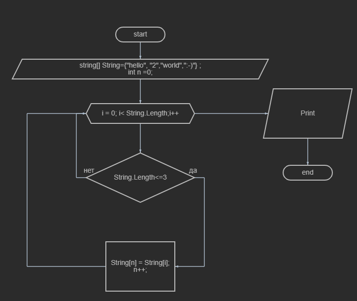

**ЗАДАЧА**

НАПИСАТЬ ПРОГРАММУ, КОТОРАЯ ИЗ ИМЕЮЩЕГОСЯ МАССИВА СТРОК,ДЛИННА КОТОРЫХ МЕНЬШЕ,ЛИБО РАВНА 3 СИМВОЛАМ.

ПЕРВОНАЧАЛЬНЫЙ МАССИВ МОЖНО ВВЕСТИ С КЛАВИАТУРЫ, ЛИБО ЗАДАТЬ НА СТАРТЕ ВЫПОНЕНИЯ АЛГОРИТМА

**АЛГОРИТМ  ЗАДАЧИ**

